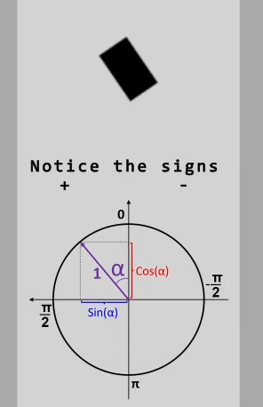
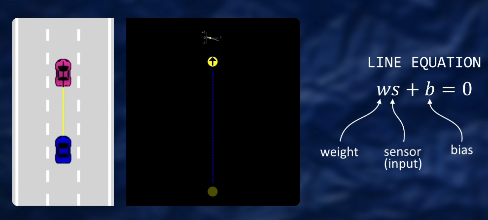
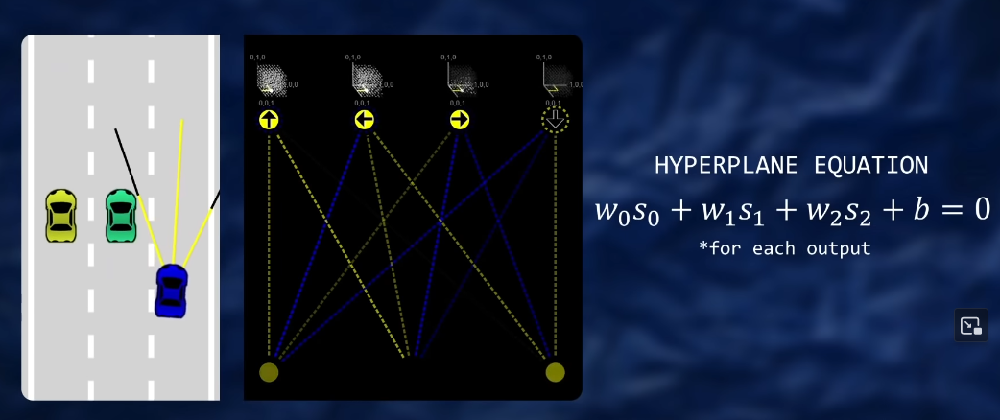

# Follow along to the self-driving car project playlist by Radu

https://www.youtube.com/playlist?list=PLB0Tybl0UNfYoJE7ZwsBQoDIG4YN9ptyY

## self-driving car setup (until before neural network part)

See code comments

## Neural network part

### hyperplane equation

For the simplest neural network, this is the line equation.

Higher dimensions:

